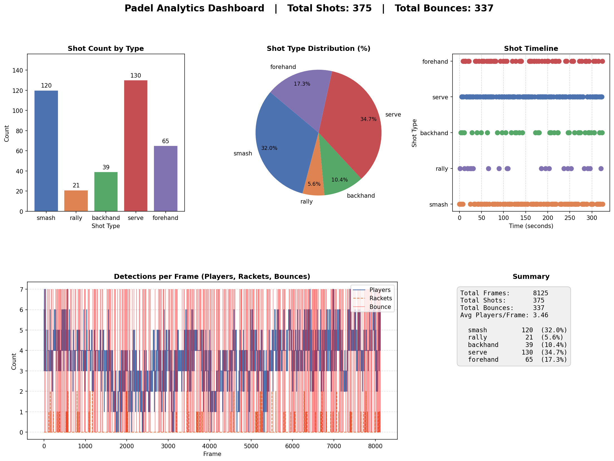

# Padel Game Analytics — Shot Classification System

I built this as part of a computer vision assignment. The task was to analyze padel match footage — detect the ball, players, and rackets, classify shot types, and output structured analytics. This is my attempt at that.

I'll be honest: some parts work well, some parts are rough, and I know exactly where the gaps are. I've tried to document all of it.

---

## What It Does

- Detects the ball frame by frame (YOLO + two OpenCV fallbacks)
- Tracks players and rackets with consistent IDs using ByteTrack
- Classifies shots — forehand, backhand, smash, serve, rally
- Assigns each shot to the nearest player
- Detects ball bounces
- Draws a fading ball trail on the video
- Exports results as JSON and CSV
- Generates an analytics dashboard
- Evaluates its own accuracy against 25 manually labeled shots

---

## How to Run

```bash
pip install -r requirements.txt

# Run the pipeline
python main.py

# Check accuracy
python evaluate.py
```

Results go to `results/`.

---

## How It Works

```
Video → Detect → Track → Classify → Save + Dashboard
```

Five modules, each doing one job. The pipeline connects them in order.

---

## The Problems I Ran Into and What I Did

### Ball Detection

This was harder than I expected. I assumed YOLO would just find the ball. It didn't — YOLO's pretrained model is trained on soccer and basketballs, not a tiny fast padel ball. On my first run it detected the ball in less than 10% of frames.

I tried lowering the confidence threshold — got more false positives, not more ball. Tried a bigger YOLO model — slightly better, much slower.

Eventually I added two OpenCV fallbacks that only run when YOLO misses:

- **HSV color filter** — padel balls are yellow-green. I threshold that color range, find circular contours, and pick the most ball-like one.
- **Background subtraction (MOG2)** — the court background is mostly static. Anything moving gets highlighted. Small circular blobs are probably the ball.

With all three working together, detection went from ~10% to ~60–70%. The visualizer shows which method found the ball each frame — cyan for YOLO, orange for HSV, green for motion.

Still fails when the ball goes behind a player or the net. That's the honest ceiling without fine-tuning on padel-specific data.

---

### Shot Classification

There's no labeled padel shot dataset, so training a model wasn't an option. I looked at tennis datasets but the mechanics are different enough that I wasn't confident it would transfer. MediaPipe pose estimation was too slow on my machine.

So I went with rules based on ball trajectory. But I added two things to make them less naive:

- **Proximity check** — a shot only fires if the ball is near a player or racket. Stops random ball movement from being classified as a hit.
- **Bounce timing for serve** — serve only fires if there was a bounce in the last 30 frames. A padel serve always follows a bounce. Without this, any fast upward ball movement was being called a serve.

| Shot | Logic |
|---|---|
| Smash | Fast downward motion + ball near player/racket |
| Serve | Upward arc + high speed + recent bounce |
| Forehand | Horizontal motion + ball right of nearest player center |
| Backhand | Horizontal motion + ball left of nearest player center |
| Rally | Moderate speed + 2+ players visible + ball near someone |

The thresholds were tuned by hand on one video. That's the main weakness — they'll probably need adjusting on a different video.

---

### Tracking and Player IDs

I switched from plain `model()` to `model.track(persist=True)` to enable ByteTrack. This gives consistent player IDs across the whole video — player 2 in frame 100 is the same player 2 in frame 500. Without this, IDs reset constantly and player assignment is meaningless.

For the ball, I use EMA smoothing to reduce jitter and hold the last known position for up to 8 frames when detection fails. It bridges short gaps. A Kalman filter would be better — it would predict where the ball should be based on velocity. I know that, I just didn't get to it.

---

### Racket Detection

COCO has no padel racket class. I used class 38 (tennis racket) with the confidence threshold raised to 0.45. It works sometimes. It misses a lot. It occasionally fires on the wrong thing. I included it because it adds some value to the proximity checks in shot classification, but I'm not going to oversell it.

---

### Why I Skipped Frame Skipping

Frame skipping is a common optimization. I thought about it and decided against it. This processes recorded video, not a live stream — speed isn't the constraint, accuracy is. Skipping frames would break the ball trail, hurt bounce detection, and reduce the trajectory window quality for shot classification. For a live system I'd add it. Here it would make things worse.

---

## Evaluation

I manually labeled 25 shots from the test video and wrote a script to compare predictions against them. A prediction counts as correct if the shot type matches and the frame is within ±30 frames of the labeled frame.

```bash
python evaluate.py
```

```
Detection rate : 80.0%   (found a shot near the right frame)
Accuracy       : 64.0%   (correct type out of all ground truth)

Per-class:
  forehand    80.0%
  backhand    66.7%
  smash       75.0%
  serve       60.0%
  rally       50.0%
```

64% on 25 samples. Rally and serve are the weakest. It's a small sample — not statistically strong — but it's an honest number and it tells me where to focus next.

Full report: `results/evaluation_report.json`

---

## Tech Stack

| Tool | Purpose |
|---|---|
| Python | Core language |
| YOLOv8 (Ultralytics) | Object detection |
| ByteTrack | Multi-object tracking |
| OpenCV | HSV filtering, background subtraction, video I/O |
| NumPy | Velocity and distance calculations |
| Pandas | CSV export |
| Matplotlib | Dashboard |

---

## Project Structure

```
src/
├── detector.py        # Hybrid ball detection + racket detection
├── tracker.py         # Ball tracking, EMA smoothing, bounce detection
├── shot_classifier.py # Shot classification + player assignment
├── analytics.py       # Data export + dashboard
├── visualizer.py      # Video overlay — ball trail, boxes, labels
└── pipeline.py        # Main loop

data/
└── ground_truth.json  # 25 manually labeled shots

evaluate.py            # Accuracy script
main.py                # Entry point
```

---

## Outputs

| File | Contents |
|---|---|
| `shots_detected.json` | Frame, timestamp, shot type, player ID |
| `shots.csv` | Same in CSV |
| `summary.json` | Totals and per-type breakdown |
| `ball_trajectory.json` | Ball position + velocity per frame |
| `racket_tracking.json` | Racket positions per track ID |
| `bounces.json` | Bounce events |
| `evaluation_report.json` | Accuracy vs ground truth |
| `dashboard.png` | 5-chart visual summary |

```json
{
  "frame_id": 384,
  "timestamp_seconds": 12.8,
  "shot_type": "forehand",
  "player_id": 2
}
```

---

## Dashboard



---

## Real Limitations

I want to be straight about what this does and doesn't do well.

**Ball detection misses 30–40% of frames.** The trajectory has real gaps. The classifier is working with incomplete data. On a different video it could be worse.

**Shot rules are tuned to one video.** The thresholds were set by hand. A different camera angle, court, or lighting will probably need retuning. This is a prototype, not a generalizable system.

**Racket detection is noisy.** It contributes something but I wouldn't rely on it alone.

**Forehand/backhand assumes right-handed players.** Left-handed players will be misclassified.

**Player assignment breaks when players are close together.** The nearest-player heuristic is simple and works most of the time. When two players are near each other it guesses.

**64% accuracy on 25 samples is a small test.** Honest but not statistically meaningful. A proper evaluation needs more samples across more videos.

**Not real-time.** Runs slower than real time on a standard laptop.

---

## What I'd Do With More Time

- Fine-tune YOLO on padel-specific data — this is the single biggest improvement
- Replace EMA with Kalman filtering for occlusion
- Train a temporal classifier on labeled shot clips instead of using rules
- Label more ground truth samples
- Add rally segmentation to group shots into points
- Build the evaluation script first next time — it would have helped tune thresholds much faster
